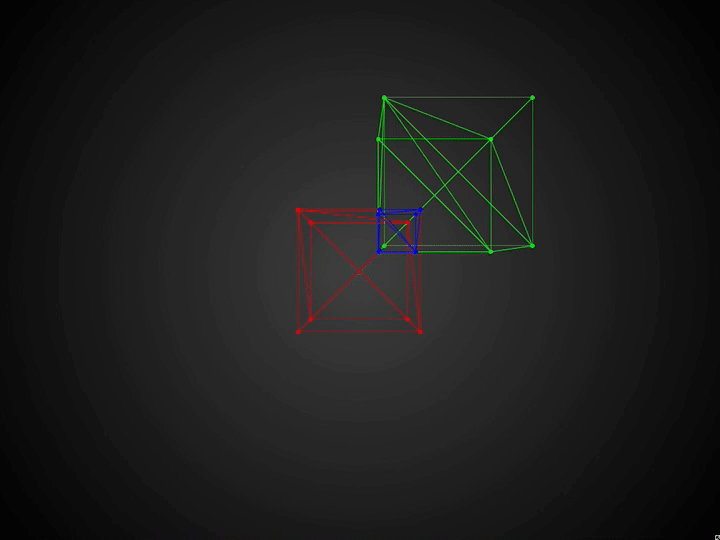

# csgjs-cppのモデル可視化プログラム
openFrameworksを利用してcsgjs_modelを可視化する関数.  
**※For Mac**



## Installation
openFrameworksを用意する.  
本プロジェクトのrootディレクトリにディレクトリ名`openFrameworks`で配置.
```bash
git clone https://github.com/icchi-h/plot_csgjs-cpp_model.git openframeworks
```

## Usage
```bash
cd main/
make
make run
```
